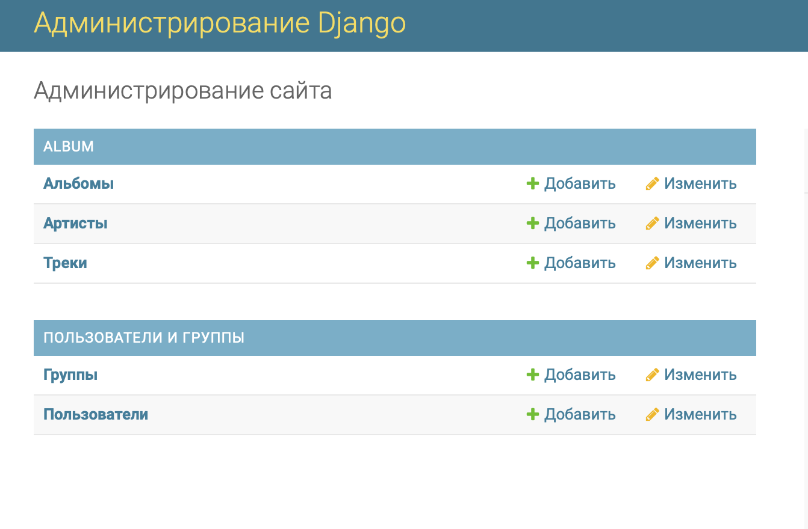
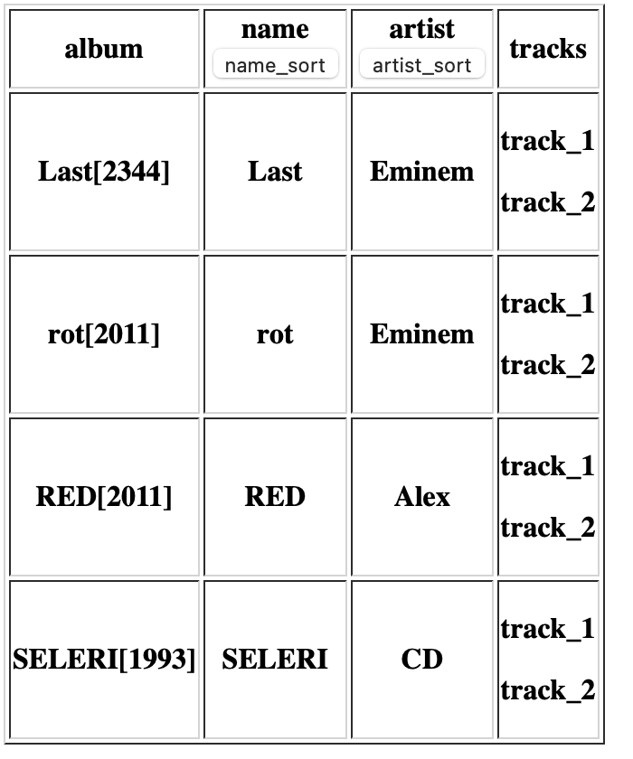
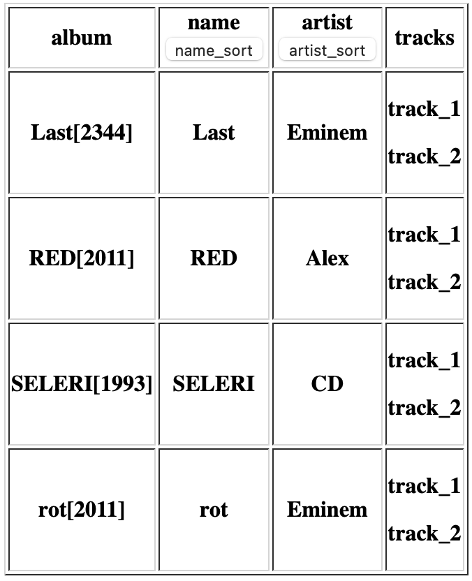
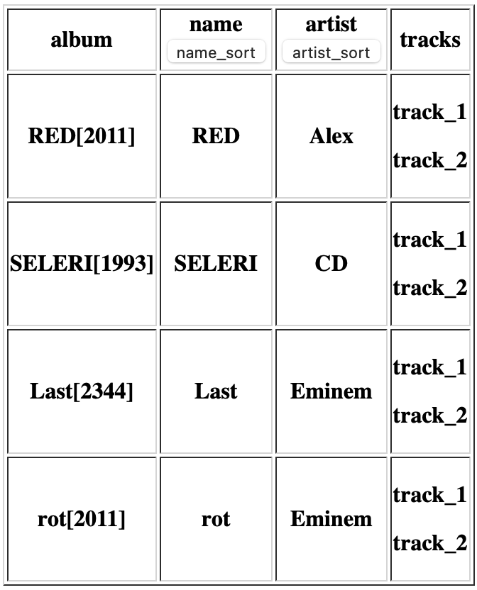

Задание:
-------
* Приложение содержит три модели:

  * Album с полем `name`, содержащим название альбома в виде строки, `artist`, ука-
    зывающий на модель Artist, `year` - год выпуска альбома в виде целого числа.
    Также модель должна иметь строковое представление в виде - `name[year]`;
  * Artist с полем `name`, содержащим имя автора в виде строки;
  * Track с полем `name` в виде строки, и с полем `album` указывающим на модель
    Album.

На главной странице отображается таблица с заголовками album, name,
artist@name, tracks и строкой под заголовками, с кнопками сортировки по
album_name, artist@name.

При загрузке страницы должны подгружаться данные из API, в виде списка словарей и
загружаться в таблицу.
```
[{
"album": "album1[2022]",
"name":"album1",
"artist@name":"artist_name1",
"tracks":["track1","track2","track3"]
}, ...]
```

Причём:
-------
1. в колонке album содержится строковое представление объекта модели Album;

2. в колонке name содержится поле name объекта модели Album;

3. в колонке artist@name содержится поле name объекта модели Artist, связан-
ной с данным объектом модели Album;

4. в колонке tracks содержатся поля name, всех объектов модели Track связанных
с данным объектом модели Album.


При нажатии на кнопку Sort происходит сортировка по данной колонке: на API отправ-
ляется запрос с параметром sorting равному названию колонки и производится сорти-
ровка по sorting, при этом должна быть осуществлена логика, по которой вложенные
поля разделяются знаком @. Отсортированные данные передаются по API и загружают-
ся в таблицу.


Запуск
------

```
git clone https://github.com/AlekseyDubinin/djangoProjectAlbum.git
cd stripe_task
python -m venv venv
.\venv\Scripts\activate
pip install -r requirements.txt
python manage.py migrate
python manage.py runserver
```

#### Для админки:
```
python manage.py createsuperuser
```

Для заполенния таблицы, можно воспользоваться панелью Администратора:
### Пример Админки:


Главная страница: http://localhost:8000/album/

Если сервер не отдаёт информацию, подождите пару секунд и перезагрузите страницу

Сервис
------

* `/` - Таблица с данными
* `admin/` - Админка
* `api/album/` - Получение информации ввиде списка словарей
* `album/?sort=name_sort` - Сортировка по название альбома
* `album/?sort=artist_sort` - Сортировка по название артиста

Скриншоты
---------

#### Главная страница с табилцей:



#### Отсортированная по названию альбома:



#### Отсортировано по названию артиста:


